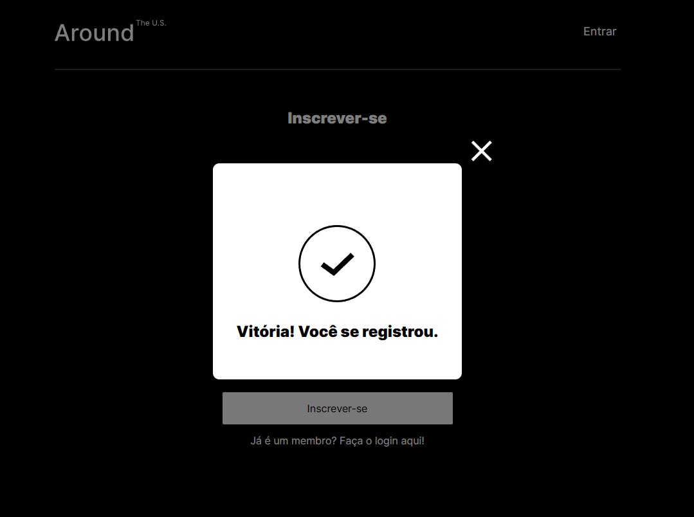

<!-- PROJECT LOGO -->
<br />
<div align="center" >
  <a href="https://github.com/github_username/repo_name">
    
  </a>

<h3 align="center">FRONT-END USER AUTHENTICATION</h3>

  <p align="center">
    TripleTen WebDev bootcamp project
  </p>
</div>

<!-- TABLE OF CONTENTS -->
<details>
  <summary>Table of Contents</summary>
  <ol>
    <li>
      <a href="#about-the-project">About The Project</a>
      <ul>
        <li><a href="#built-with">Built With</a></li>
      </ul>
    </li>
    <li>
      <a href="#getting-started">Getting Started</a>
      <ul>
        <li><a href="#prerequisites">Prerequisites</a></li>
        <li><a href="#installation">Installation</a></li>
      </ul>
    </li>
    <li><a href="#usage">Usage</a></li>
    <li><a href="#contributing">Contributing</a></li>
  </ol>
</details>

<!-- ABOUT THE PROJECT -->

## About The Project

This project implements the register and authorization of user in "The Around U.S" WebApp. Implementes these new functions on the front-end side using React.

In this project I had the oportunity to develop my knowledge about user registration and authorization in regards their differences, was able to handle with token and to know a little about ciber security.

You can check the final front-end version of the page made using React.js at [https://edu-fortes.github.io/web_project_around_auth/](https://edu-fortes.github.io/web_project_around_auth/)

### Built With

- [![React][React]][React-url]
- [![ReactRouter][ReactRouter]][ReactRouter-url]

<!-- GETTING STARTED -->

## Getting Started

To get a local copy up and running follow these simple example steps.

### Prerequisites

- Node Package Manager (npm). If not installed, follow the address to install it ([https://nodejs.org/en](https://nodejs.org/en)).

  To check if you have Node.js and NPM installed run the following in your terminal:

  - node

    ```sh
    node -v
    ```

    Expected to return your Node version.

  - npm
    ```sh
    npm -v
    ```
    Expected to return your NPM version.

### Installation

1. Fork this repo to your GitHub account
2. Clone the forked repo from your account
   ```sh
   git clone https://github.com/github_username/repo_name.git
   ```
3. Change to cloned folder
4. Install NPM packages dependencies
   ```sh
   npm install
   ```

<!-- USAGE -->

## Usage

To lauch the server with hot reload, execute:

```sh
npm run start
```

The server is going to lauch on port _3000_. Use _http://localhost:3000_ on your web browser to lauch the WebApp.

### Register new user:

As soon you load the WebApp, you will be redirect to the login page, once you are not registered yet.

To register click on the link below the "Entrar" button (marked with an orange square on the picture below).


- In the register page, fill in the requered e-mail and password fields.

**P.S: DO NOT use your personal e-mail and any of your passwords. Is not guaranteed the security of the server.**


- If every thing went right, when you click on the "Inscrever-se" button a popup will be presented with an success message. Then you will be redirect to the login page again.



### Signin

- Enter your e-mail and password created in the preview step and hit "Entrar" button.

- Again, if every thing went right, your access will be granted to the main page.


<!-- CONTRIBUTING -->

## Contributing

Contributions are what make the open source community such an amazing place to learn, inspire, and create. Any contributions you make are **greatly appreciated**.

If you have a suggestion that would make this better, please fork the repo and create a pull request. You can also simply open an issue with the tag "enhancement".
Don't forget to give the project a star! Thanks again!

1. Fork the Project

2. Create your Feature Branch

```sh
git checkout -b feature/AmazingFeature
```

3. Commit your Changes

```sh
git commit -m 'Add some AmazingFeature'
```

4. Push to the Branch

```sh
git push origin feature/AmazingFeature
```

5. Open a Pull Request

<p align="right">(<a href="#readme-top">back to top</a>)</p>

<!-- MARKDOWN LINKS & IMAGES -->
<!-- https://www.markdownguide.org/basic-syntax/#reference-style-links -->

[React]: https://img.shields.io/badge/-ReactJs-61DAFB?logo=react&logoColor=white&style=for-the-badge
[React-url]: https://react.dev/
[ReactRouter]: https://img.shields.io/badge/-React%20Router-CA4245?logo=react-router
[ReactRouter-url]: https://reactrouter.com/en/main
